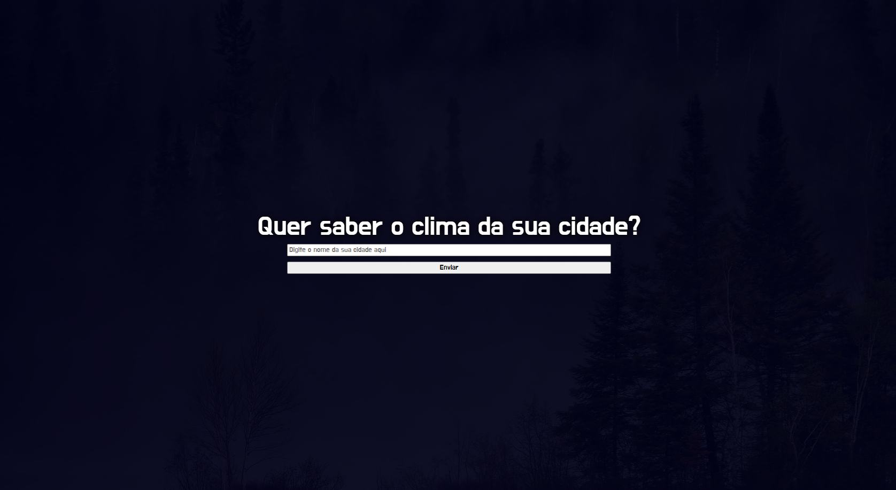
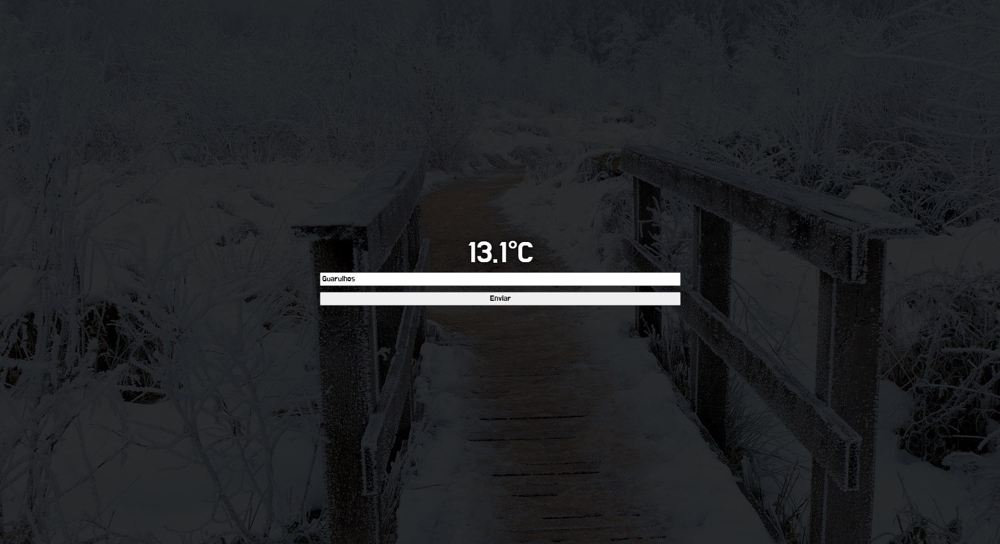

# Clima API com Flask 🌤️

Este é um projeto simples feito com **Flask** que permite ao usuário digitar o nome de uma cidade e visualizar a **temperatura atual** dessa cidade. A aplicação se conecta à **API da WeatherAPI** para obter os dados de clima em tempo real.

---

## Funcionalidades

* Entrada de cidade via formulário HTML.
* Consumo da API da WeatherAPI.
* Renderização de páginas com Flask.
* Uso de **Blueprints** para organização do código.
* Mudança dinâmica do **plano de fundo** com base na temperatura (usando JavaScript).

---

## Estrutura do Projeto

```
projeto/
├── main.py                    # Arquivo principal da aplicação Flask
├── cidade_escolhida.py      # Blueprint que trata o clima da cidade
├── templates/
│   ├── index.html            # Página inicial com o formulário
│   └── clima.html            # Página que mostra o clima
├── static/
│   ├── frio.png              # Fundo para clima frio
│   ├── tranquilo.png         # Fundo para clima ameno
│   ├── calor.png             # Fundo para clima quente
│   └── style.css             # Arquivo de estilos da aplicação Flask
│       
├── .env                      # Arquivo com chave da API 
└── requirements.txt          # Dependências do projeto
```

---

## Como rodar o projeto localmente

1. **Clone o repositório**
   `git clone https://github.com/pedromelomatos/clima-api.git`

2. **Acesse a pasta do projeto**
   `cd clima-api`

3. **(Opcional) Crie e ative um ambiente virtual**

   * No Windows:
     `python -m venv venv && venv\Scripts\activate`
   * No Linux/Mac:
     `python3 -m venv venv && source venv/bin/activate`

4. **Instale as dependências**
   `pip install -r requirements.txt`

5. **Crie um arquivo `.env` com sua chave da API**
   Exemplo de conteúdo do `.env`:

   ```
   key=SUA_CHAVE_DA_API
   ```

6. **Execute a aplicação**
   `python main.py`

7. **Acesse no navegador**
   `http://localhost:5000`

---

## Tecnologias usadas

* Python + Flask
* HTML/CSS
* JavaScript
* API externa: [WeatherAPI](https://www.weatherapi.com/)
* dotenv para variáveis de ambiente

---

## Capturas de Tela

### Tela Inicial


Apresenta o formulário para digitar o nome da cidade.

### Clima da Cidade


Exibe a temperatura atual e o fundo da página muda de acordo com o clima.

---

## Observações

* As imagens de fundo (`frio.png`, `tranquilo.png`, `calor.png`) devem estar dentro da pasta `static/`.
* A chave da API deve ser mantida em segurança no arquivo `.env`.
* O plano de fundo da página muda automaticamente conforme a temperatura retornada pela API.

